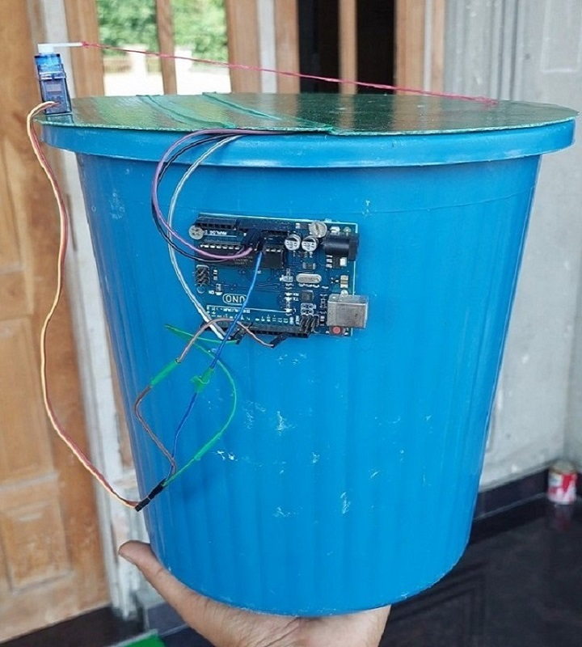

<h1 align="center">Smart Dustbin</h2>

Smart Dustbin as its name represents it works smartly or we can say that it is an Automatic Dustbin. It works likewise Smart Things.
In this project, we will make a Smart Dustbin using Arduino, where the lid of the dustbin will automatically open when you approach with trash. It is a decent gadget to make your home clean and attractive.

<h2>Presentation Link</h2>

https://docs.google.com/presentation/d/1-YAQk5i-yGcteNnJuoGzqat0Cx3TiTES/edit?usp=sharing&ouid=118370855782832481229&rtpof=true&sd=true

<h2>Components Used</h2>
<ul>
  <li>Arduino Uno</li>
  <li>SG90 Servo Motor</li>
  <li>HC-SR04 Ultrasonic Sensor</li>
  <li>Jumper Wires</li>
  </ul>
  
<h2>Sample Images</h2>

  
  

 
  
  <h2>Sample Videos</h2>
